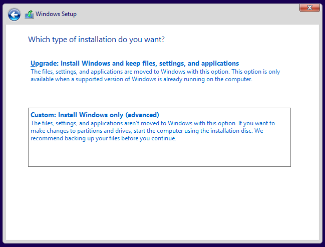
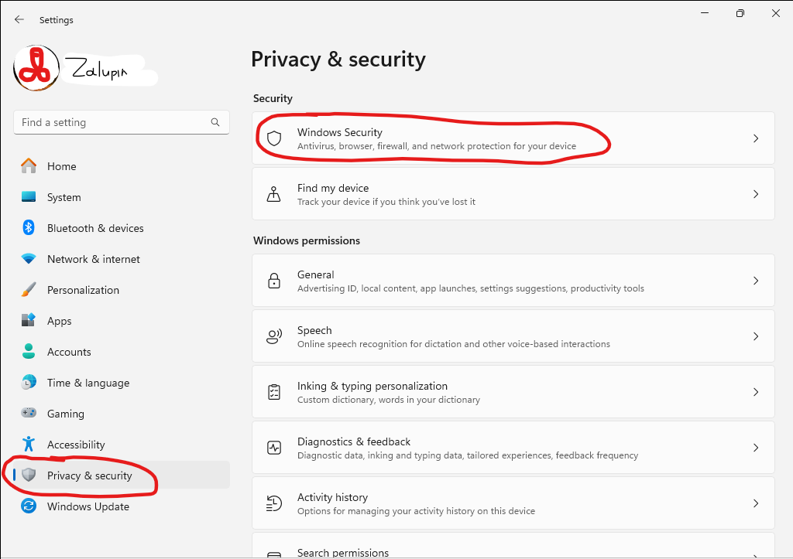
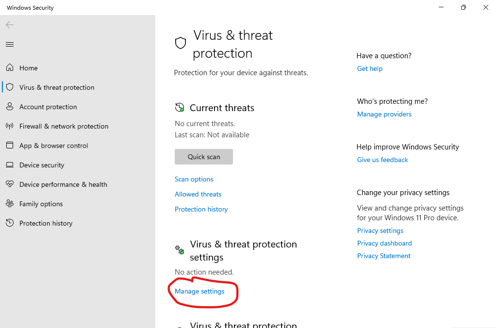
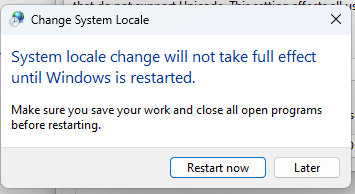

## Подготовка

### Клиент BitTorrent

Подойдет любой, но я рекомендую Transmission: https://transmissionbt.com/  
После установки и запуска заходим в настройки и включаем UPnP:  
  
Также можно нажать Test Port для проверки, должно быть open, но если нет, не страшно, работать будет.

### Что ещё скачать

1.  Более-менее безопасно использовать официальные образа MSDN из раздела "Оригинальные версии Windows" торрент трекера https://nnmclub.to  
Рекомендуется английская версия, на которую после установки и при необходимости можно штатными средствами добавить локализацию на любой язык. В том числе, таким образом, можно сделать различную локализацию для разных пользователей.  
На момент написания этого гайда актуальная версия официальной сборки называется `Microsoft Windows 11 [10.0.22631.3155]`,  
а файл образа: `en-us_windows_11_consumer_editions_version_23h2_updated_feb_2024_x64_dvd_9665512b.iso`  
Magnet ссылка для торрент клиента: [magnet:?xt=urn:btih:54686eb574adac71e27c2cb700b842abfd2538df&tr=http%3A%2F%2Fbt02.nnm-club.cc%3A2710%2F0022eb9d068a98da70412b421c849dcd%2Fannounce&tr=http%3A%2F%2Fbt02.nnm-club.cc%3A2710%2F0022eb9d068a98da70412b421c849dcd%2Fannounce](magnet:?xt=urn:btih:54686eb574adac71e27c2cb700b842abfd2538df&tr=http%3A%2F%2Fbt02.nnm-club.cc%3A2710%2F0022eb9d068a98da70412b421c849dcd%2Fannounce&tr=http%3A%2F%2Fbt02.nnm-club.cc%3A2710%2F0022eb9d068a98da70412b421c849dcd%2Fannounce)  
Если не работает клик по ссылке, то в торрент клиенте: File - Open URL.  
После добавления и начала скачивания - двойной клик по скачиваемому торренту и снимаем галки с ненужных файлов:  

    
2.  Эмулятор KMS для лицензирования, это архив, пароль 2023 (пока не распаковывать!): https://github.com/abbodi1406/KMS_VL_ALL_AIO/releases/download/v0.51.0/KMS_VL_ALL_AIO-51.7z
    
3.  Rufus - софт для нарезания правильных флешек: https://github.com/pbatard/rufus/releases/download/v4.4/rufus-4.4.exe
    
4.  Архиватор 7-Zip: https://www.7-zip.org/a/7z2301-x64.exe
    

### Создание флешки

Как скачается образ из торрента - вставляем шуструю флешку объемом минимум 8 ГБ (все данные на ней будут уничтожены!), запускаем Rufus и настраиваем:  
0\. Выбираем свою флешку

1.  Нажимаем select и выбираем скачанный образ
2.  GPT
3.  UEFI  
      
    И поехали - Start  
    Всплывет окно где можно включить различные костыли и велосипеды, не рекомендую что либо включать без особой необходимости.  
      
    По окончанию копируем на флешку (в корень или создать директорию для софта) архив с эмулятором KMS и 7-Zip.

## Установка Windows 11

### Отключаем лишнее

Выключаем компьютер, разбираем и отключаем все накопители (диски, SSD) кроме того, на который планируется установка Windows.  
Также отключаем все флешки кроме той, которую приготовили в предыдущей главе.  
По возможности лучше вообще отключить все лишнее, всякие дополнительные сетевые карты, WiFi адаптеры (если интернет идет по кабелю, а они не нужны), кард-ридеры, и т.п.

### Проверка и подготовка BIOS

Включаем компьютер и сразу ломимся в биос, вероятно это кнопки F2, F9, F10 или, скорее всего - Delete

#### Compatibility Support Module сокращенно CSM.

Это может быть настройка CSM вкл-выкл (тогда надо выключить), может быть что то вроде boot mode с вариантами UEFI или CSM, в любом случае надо CSM выключить, что бы компьютер грузился только через EFI (UEFI).

#### Secure boot

Его тоже надо выключить, эта система уже давно не дает плюсов по безопасности, но несет кучу рисков и проблем.

### Boot order

Находим и ставим вверх (первым на загрузку) свою флешку.  
Если флешка отображена дважды - наверх выносим ту запись, где указано EFI или UEFI.

#### Первый запуск с флеш

Выходим из биос с сохранением, компьютер перезагрузится и произойдет запуск с флешки.  
Вероятно она попросит ткнуть в любую кнопку для загрузки, быстро тыкаем.

#### Очистка диска

Для начала необходимо полностью очистить накопитель на который планируется установка. Не просто удалить все файлы, а убрать файловые системы, разделы, и даже разметку. Это легко сделать установщиком.

Сначала по дефолту:  

Затем **Repair your computer**:  

Выбираем Troubleshoot (других пунктов может быть больше чем на картинке):  

Далее Command Prompt:  

Откроется терминал, запускаем там diskpart:  

Даем ему команду list disk, он ответит списком накопителей.  
Их должно быть два! Флешка и накопитель на который планируется установка.  
Внимательно смотрим на объем и пытаемся понять кто есть кто, на примере ниже видно два накопителя, 64 гб SSD для установки и флешка на 32 гб (её объем будет виден не полностью, это норма). Порядок может быть любым.  
Но зная объем накопителя на который планируется установка - можно догадаться где он. Запоминаем его номер (ноль или единица)  

Даем команду select disk и номер накопителя (а не флеш!).  
В моем случае это 0:  

Далее команда clean - это полностью очистит накопитель:  

Команда exit - покидаем diskpart:  

И еще раз exit - закроется терминал. После чего выбираем выключить компьютер:  

#### Установка

Включаем обратно, он загрузится с флеш, на первом экране все по умолчанию:  

На втором Install:  

Далее честно отвечаем, что ключа нет:  

Выбираем Windows 11 Pro:  

Соглашаемся не читая с лицензией:  

Выбираем Custom:  

Тут должен быть только один диск и он должен быть Unallocated, его и выбираем:  

Далее смотрим как система распаковывает себя с флешки на накопитель, если и то и другое шустрое, да ещё и проц ого-го - можно удивится с какой скоростью это происходит, объемы там большие 6 гб на флеш превращаются в почти 30 на накопителе:  

Далее она перезагрузится и продолжит установку сама, но возможно запустит инсталлер с флешки опять, тогда перезагружаемся, идем в биос и в boot order ставим наверх Windows Boot Manager - это загрузчик установленной системы.

#### Первый запуск

После установки, перезагрузки и просмотра анимашки - выбираем страну (это влияет на региональные стандарты надписи даты и т.п.):  

Основную клавиатуру оставляем US и далее Skip добавление дополнительной, это будет позже:  
  

Где то тут, если интернет идет не по кабелю, система спросит к какой WiFi сети подключится и попросит её пароль, выбираем, даем пароль.

Вероятно тут произойдет перезагрузка (но не обязательно).

#### Продолжение первой загрузки

Вводим имя устройства, можно Skip тогда будет рандомное, но лучше написать понятное название компьютера.  
По хорошей IT традиции имена компьютеров и серверов под управлением Windows пишем большими латинскими буквами:  

Вероятно тут произойдет перезагрузка (но не обязательно).

Далее сетап для частника:  

Соглашаемся на Microsoft аккаунт:  

Вводим свою почту от Microsoft аккаунта или создаем его и почту нажав **Create one**, при желании тут же и почту под аккаунт получить можно:  
  

Далее оно нас поприветствует и предложит восстановить старые баги, вирусы и мусор с предыдущей системы, отказываемся:  

Создаем PIN, это уникальный код для входа только в этот компьютер, что бы хранить в тайне пароль от Microsoft аккаунта:  
  

Соглашение на всякие анальные зонды, в целом ничего опасного и много полезного, можно не читая принять:  

Оно предложит впарить чего то от разных партнеров и своих говнокодеров, лучше Skip:  

Далее предложит спарится с Андроид телефоном:  

Ещё предложит синхронизировать браузер Edge через Microsoft аккаунт, хорошее дело:  

Сразу после появления рабочего стола ничего лучше не трогать, там дохулион процессов на фоне идут. Раскроем трей и ждем когда значек облака очухается, побелеет и перестанет быть перечеркнутым, не исключено, что при клике будет бесконечное обновление, если за минуту ничего не изменилось - перезагружаемся:  
  

## Архиватор и Лицензирование

#### 7-Zip

Во первых понадобится архиватор, на флешке положен 7-Zip, запускаем установщик и устанавливаем:  
  
Запускаем 7-Zip от администратора, заходим в Tools - Options:  
  
  
И устанавливаем его как главный архиватор для всех пользователей, ибо штатный в Windows до сих пор кривой и работает не со всеми архивами:  
  
Там же можно выбрать другой язык интерфейса 7-Zip, он настраивается отдельно и не зависит от системы:  

#### Лицензия

Нужно **временно** отключить антивирус:  
Пуск - Шестеренка (Settings) - Privacy & Security - Windows Security - Virus & Threat protection:  
  

Откроется окно, там Manage settings и отключаем Real-time protection:  
  

Затем сворачиваем (ещё пригодится!) окно антивируса и открываем архив KMS_VL_ALL_AIO-51 с флешки, всплывет окно, выбираем 7-Zip и Always, пароль на архив - 2023:  

Переносим оттуда единственный файл на стол и запускаем его:  
  

Выбираем 2, ждем, нажимаем любую кнопку по окончанию, затем выбираем 1, ждем, нажимаем любую кнопку по окончанию и нажимаем 0 для выхода:  
  
  

Закрываем архиватор, удаляем файл со стола и включаем обратно антивирус.

## Клавиатура, системная локаль и языки интерфейса:

### Добавляем языки

1.  Пуск - Шестеренка (Settings) - Time & Language - Language & region
2.  Жмем Add a language
3.  Поиском или прокруткой ищем нужный, тыкаем в него и в Next
4.  Не меняем ничего на следующем экране (как на картинке), Install
5.  Пока ждем установки пакетов локализации повторяем пункты с 2 по 6 если необходимо добавить ещё языков интерфейса и клавиатур.  
      
      
      
    

По окончанию установки всех желаемых языков - выбираем тот, что хотим видеть для своего аккаунта основным:  
  
Система тут же предложит выйти-зайти, пока не делаем этого:  

Далее ниже выбираем **Typing**  
  
и Advanced keyboard settings  
  
Тут можно и нужно выбрать раскладку клавиатуры которая будет у пользователя по умолчанию. Рекомендуется выбрать **English (United States) - US**, это раскладка должна быть всегда и у всех, на ней безопаснее всего вводить пароли и потому неплохо бы ей быть по умолчанию.  
  
Там же можно поставить флаг **Let me use a different input method for each app window** - система будет запоминать в каком окне какая раскладка выбрана и само переключать при переключении окон. Кому то нравится, кого то раздражает, полезно знать где эта настройка.

Возвращаемся в Time & language > Language & region  
Проматываем ниже и жмем Administrative language settings:  

Откроется окно, на второй вкладке Administrative жмем **Change system locale...**  
Тут сложно, нужно выбрать тот язык, на котором есть вероятность запуска старых программ или игр, либо чего то с колхозным переводом.  
Например, хотим иногда запускать игру 2004 года которую руссефецеравол какой то лютый пират из нулевых - выбераем Russian (Russia).  
Жмем ОК, оно тут же предложит перезагрузится - отказываемся - Later.  
  
  

Жмем **Copy settings...**  
  
Тут показаны наши языковые настройки, настройки которые будут на экране входа в систему и то, что будет у новых пользователей по умолчанию.  
И два флага которые могут привнести наши настройки на экран входа и всем новым пользователям, соответственно. Причем первый заменяет оба, а второй может работать отдельно, но лучше поставить оба ибо реализовано кривовато.  
Таким образом, выбрав себе (временно, например) какой то язык и клавиатуру - мы можем это распространить.  

Система предложит перезагрузится, соглашаемся.

### Создание других пользователей

Основной аккаунт, как первый на компе - с административными правами, рекомендуется для всех остальных пользователей сделать свои отдельные аккаунты без таковых прав.  
Пуск - Параметры (Settings) - Учетные записи (Accounts) - Other users (Другие пользователи) либо Семья (Family)  
  
В обоих случаях можно добавить пользователей как с Microsoft Account так и без них, а так же непосредственно в настройках его создать. Отличие в том, что в семейном разделе можно создавать не просто пользователей, а специальные аккаунты для детей, настроить цензуру и т.п. Работоспособность всего этого вызывает сомнения.

## Важное в биосе и подключение обратно остальных накопителей

Заходим в биос, смотрим на Boot Order - там должна быть одна запись - Windows Boot Manager и перед или после этих слов некая информация о накопителе на котором стоит система, это может быть цифра или его уникальный номер, записываем это.  
Выключаем компьютер, возвращаем отключенные перед установкой старые накопители, включаем и сразу бежим в биос.  
**Загрузка старой системы чревата повреждением загрузчика новой системы.**  
Поэтому ещё раз смотрим на Boot Order и делаем так, что бы в нем была **только одна** запись - тот Windows Boot Manager с теми цифрами или кодом который записали ранее. Выходим с сохранением.